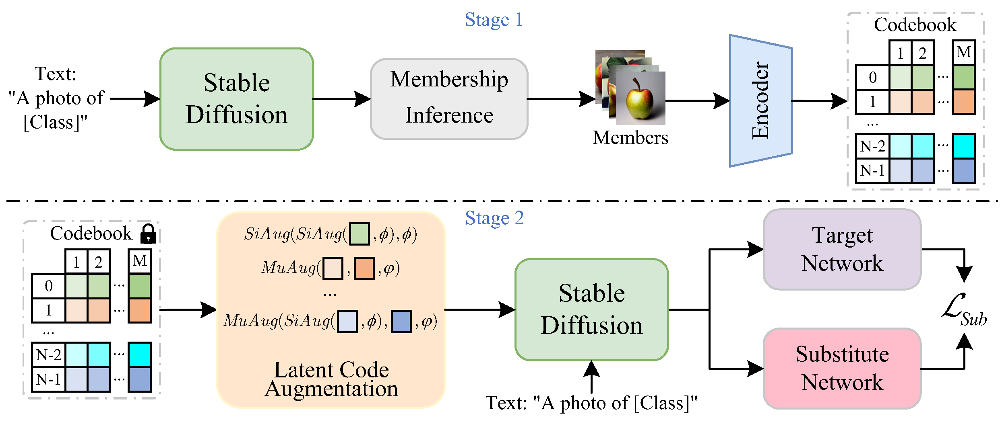
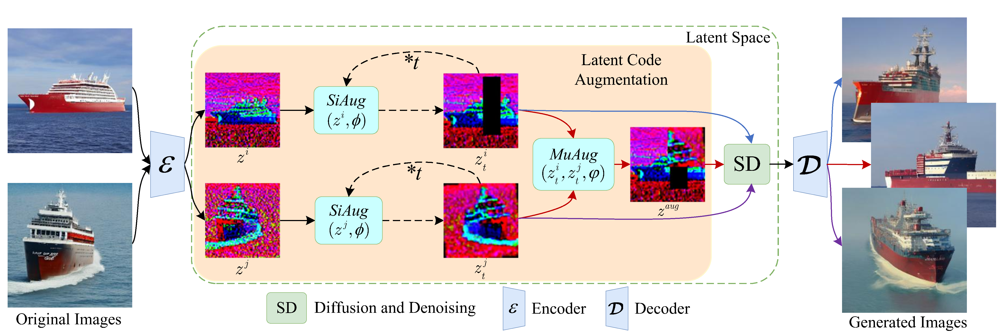

# Latent Code Augmentation
*This project is the main code for LCA, more details will be published when the article is accepted.*

[**Latent Code Augmentation based on Diffusion Model for Data-free Substitute Attacks**](https://arxiv.org/abs/2307.12872)<br/>
Anonymous Submission
<br/>
_Underview |
[GitHub](https://github.com/LzhMeng/LCA) | [Project page](https://)_


### Abstract ###
Since the training data of the target model is not available in the black-box substitute attack, most recent schemes utilize GANs to generate data for training the substitute model. However, these GANs-based schemes suffer from low training efficiency as the generator needs to be retrained for each target model during the substitute training process, as well as low generation quality.

To overcome these limitations, we consider utilizing the diffusion model to generate data, and propose a data-free substitute attack scheme based on the Stable Diffusion (SD) to improve the efficiency and accuracy of substitute training.
Despite the data generated by the SD exhibiting high quality, it presents a different distribution of domains and a large variation of positive and negative samples for the target model.
For this problem, we propose Latent Code Augmentation (LCA) to facilitate SD in generating data that aligns with the data distribution of the target model. Specifically, we augment the latent codes of the inferred member data with LCA and use them as guidance for SD. 
With the guidance of LCA, the data generated by the SD not only meets the discriminative criteria of the target model but also exhibits high diversity. 

By utilizing this data, it is possible to train the substitute model that closely resembles the target model more efficiently.
Extensive experiments demonstrate that our LCA achieves higher attack success rates and requires fewer query budgets compared to GANs-based schemes for different target models. 

- To the best of our knowledge, we are the first to use diffusion model to improve the performance of data-free substitute attacks, making substitute training more efficient and achieving higher attack success rates.
- We propose LCA to augment the latent code and use it as a guide for the diffusion model to further facilitate the diffusion model to generate data that is more suitable for the distribution of the target network.
- The experimental results demonstrate that our LCA outperforms GANs-based schemes in terms of attack success rates and query efficiency across different target networks trained on various training sets.
- It is based on pretrained [Stable Diffusion](https://github.com/CompVis/latent-diffusion).

## Requirements
A suitable [conda](https://conda.io/) environment named `LCA` can be created
and activated with:

```
conda env create -f environment.yaml
conda activate ldm
```

## Latent Code Augmentation


The latent code augmentation scheme does not depend on the original data; 
it obtains the member data of the target network based on membership inference, 
which is very likely to belong to the training set of the substitute model. 
The latent code augmentation of the membership data is augmented and used to guide 
the diffusion model to generate more data suitable for the target network.

### Stable Diffusion
We used pretrained Stable Diffusion v1 as the base diffusion model to generate the data, 
which is a general text-to-image diffusion model. 

#### Weights
The weights are available via [the CompVis organization at Hugging Face](https://huggingface.co/CompVis).

In order to keep the scheme basic, we use the most basic version of the model:
- [`sd-v1-1.ckpt`](https://huggingface.co/CompVis/stable-diffusion-v-1-1-original): 194k steps at resolution `512x512` on [laion-high-resolution](https://huggingface.co/datasets/laion/laion-high-resolution) (170M examples from LAION-5B with resolution `>= 1024x1024`).

### Stage 1
In the first stage, we employ **Membership Inference (MI)** to identify samples that are most likely to belong to the member data of target model. 
Then, these samples are encoded and stored into the **codebook**.

After obtaining the `stable-diffusion-v1-1-1-original` weights (#weights), link them
```
mkdir -p models/ldm/stable-diffusion-v1/
ln <path/to/model.ckpt> models/ldm/stable-diffusion-v1/model.ckpt 
```
and Run the first stage with
```
python scripts/stage1.py --target_model <path-to-target-model.pth> --codebookdir <path-to-codebook-to-save> 
```

By default, this uses a guidance scale of `--scale 7.5`, [Katherine Crowson's implementation](https://github.com/CompVis/latent-diffusion/pull/51) of the [DDIM](https://arxiv.org/abs/2010.02502) sampler, 
and renders images of size 512x512 (which it was trained on) in 50 steps. 

### Stage 2
In the second stage, we **augment the latent codes** and combine the prompt of the corresponding classes to guide the diffusion model to generate data. 
Guided by both text prompt and latent codes conditions, the data generated by the diffusion model retains the features 
of the member data at the feature level and adheres to the categories at the semantic feature level.

Run the second stage with
```
python scripts/stage2.py --codebookdir <path-to-codebook> 
```

## Outputs


By performing LCA at the feature level, the diffusion model is able to produce images with enhanced diversity 
while retaining the distinctive characteristics of the member data. 
This LCA approach is able to generate visually appealing images with specific attributes that visually outperform 
traditional data augmentation techniques.

## Comments 

- The diffusion model used in our scheme is built heavily on [Stable Diffusion](https://github.com/CompVis/latent-diffusion).
- The white-box adversarial sample generation method uses [AdverTorch](https://github.com/borealisai/advertorch)
- Thanks to the [DaST](https://github.com/zhoumingyi/DaST) open-sourcing.


## BibTeX

```
@misc{LCA2023datafree,
      title={Latent Code Augmentation based on Diffusion Model for Data-free Substitute Attacks}, 
      author={Anonymous Submission},
      year={2023},
      eprint={2307.12872},
      archivePrefix={arXiv},
      primaryClass={cs.CV}
}
```


